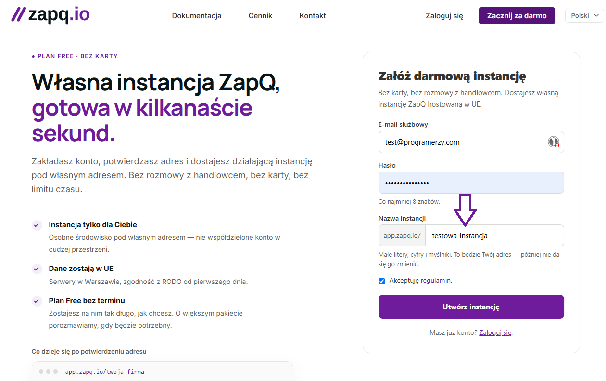
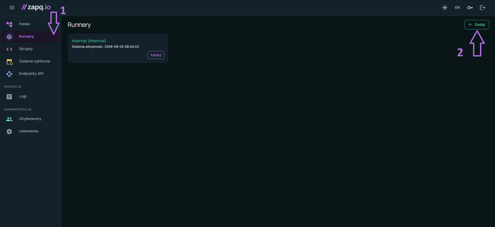
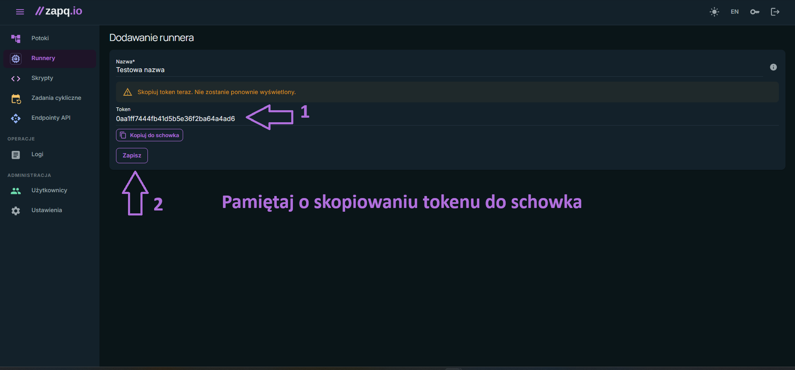
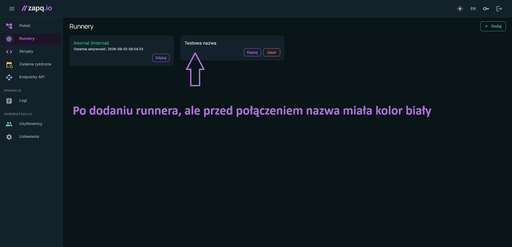
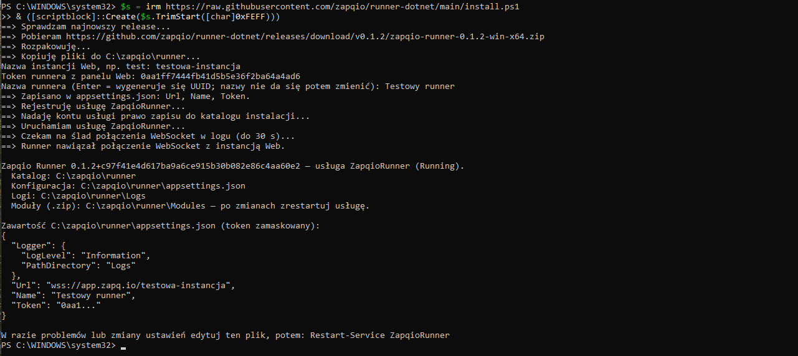
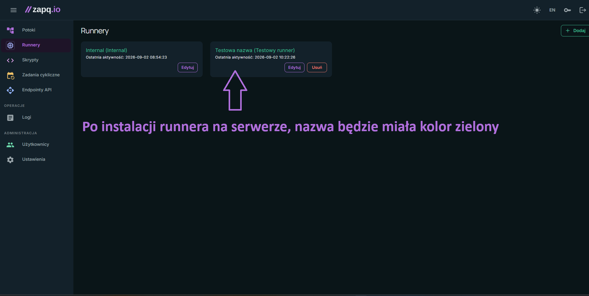

# Zapqio Runner (.NET)

Runner Zapqio w .NET — łączy się z serwerem **Web** Zapqio przez WebSocket i wykonuje zlecane
zadania.

Gotowe paczki do pobrania: [GitHub Releases](https://github.com/zapqio/runner-dotnet/releases).

Ten plik obejmuje instalację od zera do działającego runnera. Tematy eksploatacyjne —
konfiguracja, moduły, zarządzanie usługą, logi, aktualizacja i rozwiązywanie problemów —
są w [szczegółach](./docs/szczegoly.md).

## Jak to działa

- Runner jest **klientem** WebSocket. Łączy się z `{Url}/ws-runner`, uwierzytelnia tokenem i nazwą,
  ogłasza listę metod, które potrafi wykonać, a potem odbiera zadania, potwierdza je, wykonuje
  i odsyła wyniki.
- Sam runner nie umie wykonać niczego — **metody dostarczają moduły** (paczki `.zip` w katalogu
  `Modules`, patrz [Moduły](./docs/szczegoly.md#2-moduły--czym-runner-wykonuje-zadania)).
  Runner bez modułów połączy się i zgłosi pustą listę metod.
- W danej chwili wykonuje **jedno** zadanie. To, co metoda wypisze na konsolę, trafia na żywo do
  logów zadania w panelu Web.
- Zerwane połączenie odtwarza sam, z narastającą zwłoką (3 s → 60 s) — restart usługi nie jest do
  tego potrzebny.

## Instalacja jako usługa Windows (Windows Service)

Runner ma wbudowane wsparcie dla trybu usługi Windows — uruchomiony przez menedżera usług
sam wykrywa ten tryb, nie wymaga dodatkowych przełączników.

Najkrótsza droga to skrypt [`install.ps1`](./install.ps1), który pobiera paczkę, pyta
o konfigurację i zakłada usługę jednym poleceniem — patrz
[Instalacja usługi](#2-instalacja-usługi). Ręczne zmiany konfiguracji opisuje
[Konfiguracja](./docs/szczegoly.md#1-konfiguracja) w szczegółach.

### 1. Wymagania

- **Windows x64** z listy systemów wspieranych przez .NET 10: Windows 10 od wersji 1607, Windows 11
  oraz Windows Server od 2012 R2
  ([pełna lista](https://github.com/dotnet/core/blob/main/release-notes/10.0/supported-os.md)).
- **Zainstalowany .NET Desktop Runtime 10 (x64).** Paczka `win-x64` jest framework-dependent, więc
  nie zawiera runtime'u. Potrzebny jest wariant *Desktop* (zawiera zwykły .NET Runtime), bo runner
  odwołuje się do `Microsoft.WindowsDesktop.App`. Najprościej:
  `winget install Microsoft.DotNet.DesktopRuntime.10`, albo instalator ze strony
  [dotnet.microsoft.com](https://dotnet.microsoft.com/download/dotnet/10.0) (sekcja *.NET Desktop
  Runtime*, Windows x64). Skrypt instalacyjny sprawdza to na starcie i bez runtime'u się zatrzymuje.
- **Wariant .NET 8** — `install.ps1 -Net8` instaluje paczkę `win-x64-net8` dla maszyn z modułami,
  które nie działają na .NET 10; wymaga wtedy **.NET Desktop Runtime 8 (x64)**
  (`winget install Microsoft.DotNet.DesktopRuntime.8`). Dotyczy m.in. modułu nexo: obfuskowane
  biblioteki InsERT-a (`InsERT.Moria.Sfera` i pokrewne) od .NET 9 są odrzucane przez loader.
- Konto z uprawnieniami administratora (instalacja usługi).
- Wychodzący dostęp sieciowy do instancji Web (WebSocket, `wss://…`, zwykle TCP 443). Runner
  niczego nie nasłuchuje — nie trzeba otwierać portów przychodzących.
- Prawo zapisu w katalogu instalacji: runner zapisuje obok binarki swoją nazwę (`##Name`),
  rozpakowane moduły i logi.

### 2. Instalacja usługi

Całą instalację wykonuje skrypt [`install.ps1`](./install.ps1): pobiera paczkę win-x64
z GitHub Releases (domyślnie najnowszą), rozpakowuje ją, zapisuje konfigurację
w `appsettings.json`, rejestruje usługę i czeka, aż runner potwierdzi w logu nawiązanie
połączenia WebSocket z instancją Web.

Do instalacji potrzebujesz dwóch rzeczy: **nazwy instancji** i **tokenu runnera**.

**Nazwa instancji** to segment ścieżki w adresie Twojej instancji Web, wybrany przy jej
zakładaniu: dla `https://app.zapq.io/testowa-instancja` nazwą instancji jest
`testowa-instancja`.



**Token runnera** generujesz w panelu Web: wejdź w **Runnery** i kliknij **Dodaj**:



Nadaj runnerowi nazwę i **od razu skopiuj token** — Web przechowuje wyłącznie skrót, więc
jawna wartość jest widoczna tylko w tym momencie; zgubionego tokenu nie da się odczytać,
trzeba wydać nowy. Dopiero potem kliknij **Zapisz**:



Nowy runner pojawi się na liście — dopóki nic się z nim nie połączyło, jego nazwa jest biała:



Mając nazwę instancji i token: skopiuj poniższe i uruchom w PowerShellu **jako
administrator** — skrypt pobierze się sam i dopyta o nazwę instancji i token:

```powershell
$s = irm https://raw.githubusercontent.com/zapqio/runner-dotnet/main/install.ps1
& ([scriptblock]::Create($s.TrimStart([char]0xFEFF)))
```

Jeśli wolisz podać wszystko od razu, bez dopytywania:

```powershell
$s = irm https://raw.githubusercontent.com/zapqio/runner-dotnet/main/install.ps1
& ([scriptblock]::Create($s.TrimStart([char]0xFEFF))) -Instance moja-instancja -Token <token>
```



Z klonu repozytorium po prostu `.\install.ps1 -Instance … -Token <token>`. O brakującą nazwę
instancji i token skrypt dopyta interaktywnie (odpowiedź jest wymagana), o nazwę runnera
też (Enter = wygenerowany UUID). W sesji bez konsoli, bez adresu i tokenu zainstaluje
usługę, ale jej nie uruchomi.

Po udanej instalacji nazwa runnera w panelu zmienia kolor na zielony, a obok niej pojawia
się w nawiasie nazwa zgłoszona przez samego runnera (klucz `Name`):



Parametry (wszystkie opcjonalne):

| Parametr | Opis |
| --- | --- |
| `-Instance` | Nazwa instancji Web (np. `test`) — skrypt buduje z niej adres `wss://app.zapq.io/<nazwa>` i zapisuje jako `Url`. |
| `-Url`, `-Token`, `-RunnerName` | Lądują w `appsettings.json` jako `Url`, `Token` i `Name` — znaczenie w [Konfiguracji](./docs/szczegoly.md#1-konfiguracja). `-Url` to pełny adres na przypadki niestandardowe (np. lokalne `ws://…`) — używany zamiast `-Instance`. |
| `-LogLevel`, `-LogDirectory` | `Logger:LogLevel` i `Logger:PathDirectory`; `-LogDirectory ""` wyłącza logi plikowe (w usłudze niezalecane — patrz [Logi i diagnostyka](./docs/szczegoly.md#4-logi-i-diagnostyka)). |
| `-Version` | Konkretna wersja release'u (np. `0.1.1`); domyślnie najnowsza. |
| `-InstallDir` | Katalog instalacji, domyślnie `C:\zapqio\runner`. |
| `-ServiceName` | Nazwa usługi Windows, domyślnie `ZapqioRunner`. |
| `-LocalSystem` | Zostawia usługę na koncie LocalSystem zamiast konta wirtualnego (patrz niżej). |

Co skrypt ustawia poza samą rejestracją:

- **Konto usługi.** Runner wykonuje kod pochodzący z modułów, więc zamiast LocalSystem
  (pełne uprawnienia lokalne) usługa dostaje konto wirtualne `NT SERVICE\ZapqioRunner` —
  powstaje razem z usługą, nie ma hasła — z prawem zapisu wyłącznie do katalogu instalacji.
  Jeśli moduły sięgają po zasoby sieciowe albo bazę z uwierzytelnianiem Windows, przełącz
  usługę po instalacji na konto domenowe z uprawnieniem *Log on as a service*:
  `sc.exe config ZapqioRunner obj= "DOMENA\konto" password= "..."`.
- **Polityka restartu.** Po awarii procesu SCM wznawia usługę po 5 s, 30 s i 60 s (licznik
  zeruje się po dobie). Nie dotyczy to zerwanego połączenia z Web — to runner obsługuje sam,
  w pętli. Warto też wiedzieć, że host zatrzymany po nieobsłużonym wyjątku kończy proces
  kodem 0, a takiego wyjścia SCM nie uzna za awarię i usługi nie wznowi — polityka łapie
  twarde awarie procesu, nie każde zatrzymanie.
- **ACL na konfiguracji.** Gdy podasz token, dostęp do `appsettings.json` zostaje zawężony
  do SYSTEM, administratorów i konta usługi.

Ręczna instalacja bez skryptu to dokładnie te polecenia `sc.exe` i `icacls`, które
znajdziesz w źródle skryptu.

### 3. Odinstalowanie

```powershell
sc.exe stop ZapqioRunner
sc.exe delete ZapqioRunner
Remove-Item -Recurse -Force C:\zapqio\runner   # opcjonalnie
```

`sc.exe delete` usuwa wyłącznie wpis usługi — katalog instalacji z konfiguracją, tokenem, modułami
i logami zostaje na dysku. Skasuj go osobno, jeśli maszyna nie będzie już runnerem; pamiętaj, że
`appsettings.json` zawiera sekret.

Po stronie Web runner nadal istnieje jako rekord z powiązaną nazwą — usunięcie go albo unieważnienie
tokenu robi się w panelu instancji. Dopóki token jest ważny, ta sama para token + nazwa może wrócić
na innej maszynie.
